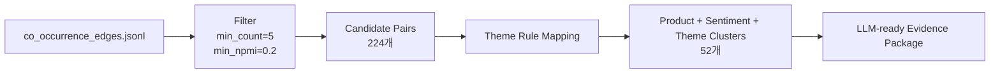

# Task 2.2 Network Analysis PPT 제작용 정리

## 1. 프로젝트 개요

### 주제

**Graph DB 기반 전자제품 리뷰 키워드 연관성 BI 분석**

### 목적

쿠팡 전자제품 리뷰에서 고객이 제품을 어떤 단어와 함께 인식하는지 파악한다. 단순 키워드 빈도가 아니라, 같은 리뷰 안에서 함께 등장한 키워드쌍의 연관 강도(PMI/NPMI)를 계산하고 이를 Neo4j Graph DB에 적재해 제품별 핵심 인식 맥락을 도출한다.

최종적으로 LLM 기반 context labeling을 통해 고객 인식을 **제품 기능 이슈**, **배송/포장/구매 경험 이슈**, **가격/프로모션**, **CS/사후관리** 등으로 구분하고, 마케팅 메시지, 제품 개선, CS 대응 액션으로 연결한다.

### 분석 질문

- 고객은 각 제품을 어떤 키워드 조합과 함께 인식하는가?
- 긍정/부정 리뷰에서 강하게 연결되는 연관어쌍은 어떻게 다른가?
- 제품 기능 이슈와 구매/배송 경험 이슈는 어떻게 분리되는가?
- Graph DB로 제품-리뷰-키워드-맥락-액션을 탐색할 수 있는가?

---

## 2. 전체 프로젝트 구조도

PPT에서는 아래 구조를 한 장짜리 파이프라인 다이어그램으로 시각화하면 좋다.

```mermaid
flowchart LR
    A[Raw Review JSON<br/>review_for_analysis.json] --> B[Step 2<br/>리뷰 정제]
    B --> C[Cleaned Reviews<br/>cleaned_reviews.jsonl]
    C --> D[Step 3<br/>Kiwi 형태소 분석<br/>키워드 추출]
    D --> E[Review-Keyword Edges<br/>keywords.jsonl<br/>review_keyword_edges.jsonl]
    E --> F[Step 4<br/>Co-occurrence<br/>PMI/NPMI 계산]
    F --> G[Keyword Network<br/>co_occurrence_edges.jsonl]
    G --> H[Step 5<br/>Neo4j Graph DB 적재]
    H --> I[Product-Review-Keyword-Sentiment Graph]
    G --> J[Step 6 Pre-LLM<br/>Context 후보/클러스터 생성]
    J --> K[52 Context Clusters]
    K --> L[LLM Context Labeling]
    L --> M[ContextLabel<br/>BusinessAction]
    M --> H
```



### 발표용 핵심 메시지

이 프로젝트는 리뷰 텍스트를 바로 요약하지 않고, 먼저 **키워드 네트워크를 구성한 뒤**, 네트워크에서 중요한 맥락 후보를 뽑아 LLM이 해석하도록 설계했다. 따라서 LLM 해석 결과가 단순 감상이 아니라 PMI/NPMI와 리뷰 근거에 기반한다.

---

## 3. 사용 데이터

### 입력 데이터

| 항목 | 내용 |
| --- | --- |
| 원본 파일 | `si_dataset/review_for_analysis.json` |
| 도메인 | 쿠팡 전자제품 리뷰 |
| 제품 수 | 7개 제품 그룹 |
| 원본 리뷰 수 | 2,757개 |
| 정제 후 리뷰 수 | 2,748개 |
| 주요 텍스트 | title, content, survey answer |
| 주요 메타데이터 | product_name, item_name, rating, helpful_count, review_at |

### 제품별 리뷰 수

| product_name | review_count |
| --- | ---: |
| iphone_17_pro | 465 |
| iphone_17 | 429 |
| galaxy_s26_ultra | 401 |
| galaxy_z_flip7 | 395 |
| galaxy_s26 | 379 |
| galaxy_z_fold7 | 368 |
| iphone_17_pro_max | 311 |

### 평점/감성 분포

| sentiment_id | 기준 | review_count |
| --- | --- | ---: |
| positive | rating 4-5 | 2,466 |
| neutral | rating 3 | 85 |
| negative | rating 1-2 | 197 |

| rating | review_count |
| --- | ---: |
| 1 | 165 |
| 2 | 32 |
| 3 | 85 |
| 4 | 215 |
| 5 | 2,251 |

### 발표 시 유의점

리뷰 데이터가 5점/긍정 리뷰에 크게 치우쳐 있다. 따라서 최종 인사이트 발표에서는 긍정 리뷰의 강점 메시지와 부정 리뷰의 리스크 신호를 분리해서 해석해야 한다.

---

## 4. Graph Schema 설계

### 핵심 노드

| Node | 역할 | Primary Key |
| --- | --- | --- |
| Product | 제품 그룹 | product_name |
| Review | 개별 리뷰 | review_id |
| Keyword | 형태소/구문 기반 키워드 | keyword_id |
| Sentiment | 평점 기반 감성 | sentiment_id |
| ContextLabel | LLM 기반 고객 인식 맥락 | context_id |
| BusinessAction | BI 액션 | action_id |

### 핵심 관계

| Relationship | 의미 |
| --- | --- |
| Product - HAS_REVIEW -> Review | 제품에 달린 리뷰 |
| Review - HAS_SENTIMENT -> Sentiment | 평점 기반 감성 |
| Review - MENTIONS -> Keyword | 리뷰가 키워드를 언급 |
| Keyword - CO_OCCURS_WITH -> Keyword | 같은 리뷰 내 키워드 동시 등장 |
| Product - HAS_CONTEXT -> ContextLabel | 제품별 고객 인식 맥락 |
| ContextLabel - EXPLAINS_PAIR -> Keyword | 맥락을 구성하는 키워드쌍 |
| ContextLabel - SUPPORTED_BY -> Review | 맥락의 근거 리뷰 |
| ContextLabel - MAPS_TO -> BusinessAction | 맥락과 BI 액션 연결 |

### 스키마 설계 이유

- 중복 노드 생성을 막기 위해 `Product.product_name`, `Review.review_id`, `Keyword.keyword_id`, `Sentiment.sentiment_id`에 unique constraint를 생성했다.
- PMI/NPMI는 키워드쌍 속성이므로 `CO_OCCURS_WITH` 관계에 `count`, `pmi`, `npmi`, `scope`, `product_name`, `sentiment_id`를 저장했다.
- Step 6 해석 결과는 Graph DB에서 탐색 가능하도록 `ContextLabel`, `BusinessAction`으로 확장했다.

---

## 5. Step 2: 리뷰 데이터 정제

### 처리 방식

`title`, `content`, `survey answer`를 통합해 분석용 텍스트 `analysis_text`를 생성했다.

```text
제목: {title}
본문: {content}
설문: {question}: {answer} / ...
```

### 제거/정제 기준

| 기준 | 결과 |
| --- | ---: |
| 원본 리뷰 | 2,757 |
| 분석 텍스트 결측 제거 | 4 |
| 너무 짧은 리뷰 제거 | 3 |
| 중복 텍스트 제거 | 2 |
| 최종 정제 리뷰 | 2,748 |

### 정제 후 필드

`cleaned_reviews.jsonl`에는 다음 필드를 유지했다.

```json
{
  "review_id": "...",
  "product_name": "...",
  "item_name": "...",
  "rating": 1,
  "sentiment_id": "negative",
  "analysis_text": "...",
  "helpful_count": 3,
  "review_at": 1774188148000
}
```

### 결과 요약

| 항목 | 값 |
| --- | ---: |
| 정제 리뷰 수 | 2,748 |
| 분석 텍스트 평균 길이 | 593.77자 |
| 분석 텍스트 최소 길이 | 14자 |
| 분석 텍스트 최대 길이 | 5,252자 |

### PPT 시각화 제안

- 원본 리뷰 수에서 정제 리뷰 수로 이어지는 funnel chart
- 제품별 리뷰 수 bar chart
- 평점 분포 stacked bar chart

---

## 6. Step 3: 형태소 분석 기반 키워드 추출

### 시도와 판단

초기에는 단순 규칙 기반 키워드 추출도 가능했지만, 한국어 리뷰에서는 형태소 분석 품질이 중요하므로 형태소 분석기를 도입했다.

우선순위:

1. Kiwi
2. Okt
3. Mecab

최종적으로 **Kiwi**를 사용했다. Kiwi는 설치 난이도와 품질의 균형이 좋아 한국어 리뷰 분석에 적합했다.

### 추출 대상

| pos_group | 설명 |
| --- | --- |
| noun | 제품 속성/경험 명사 |
| adjective | 좋다, 빠르다, 무겁다 등 평가 표현 |
| verb | 찍다, 쓰다, 받다 등 사용/경험 행동 |
| phrase | 설문 응답과 문맥 기반 구문 키워드 |

### 주요 처리

- 제품명, 조사성 표현, 너무 일반적인 단어는 stopword 처리
- 설문 문항은 원문 그대로 키워드화하지 않고 의미 있는 phrase로 변환
- 예: `카메라 성능: 아주뛰어나요` -> `카메라 만족`
- keyword_id 충돌 방지를 위해 정규화/특수문자 제거 규칙 적용

### 결과

| 항목 | 값 |
| --- | ---: |
| 리뷰 수 | 2,748 |
| 고유 키워드 수 | 3,871 |
| Review-Keyword 관계 수 | 79,775 |
| 리뷰당 평균 키워드 수 | 29.03 |
| 빈 키워드 리뷰 수 | 3 |

### 품사 그룹별 키워드 수

| pos_group | keyword_count |
| --- | ---: |
| noun | 3,120 |
| verb | 561 |
| adjective | 164 |
| phrase | 26 |

### 상위 키워드 예시

| keyword | pos_group | df | tf |
| --- | --- | ---: | ---: |
| 가성비 좋다 | phrase | 2,095 | 2,214 |
| 디자인 만족 | phrase | 2,074 | 2,096 |
| 카메라 만족 | phrase | 1,931 | 1,967 |
| 만족 | noun | 1,439 | 2,981 |
| 배터리 오래감 | phrase | 1,425 | 1,855 |
| 카메라 | noun | 1,298 | 2,860 |
| 무게 가볍다 | phrase | 1,227 | 1,303 |
| 배송 | noun | 825 | 1,411 |

### PPT 시각화 제안

- 품사 그룹별 키워드 수 donut chart
- 상위 키워드 df/tf 비교 bar chart
- 리뷰 1개에서 Review -> Keyword로 연결되는 예시 그래프

---

## 7. Step 4: PMI/NPMI 기반 연관어 네트워크 계산

### 왜 PMI/NPMI를 사용했는가

단순 빈도는 많이 등장하는 키워드에 유리하다. PMI/NPMI는 두 키워드가 우연히 함께 등장하는 수준보다 얼마나 강하게 연결되는지를 계산한다.

```text
P(a) = keyword_a_count / review_count
P(b) = keyword_b_count / review_count
P(a,b) = co_count / review_count
PMI(a,b) = log2(P(a,b) / (P(a) * P(b)))
NPMI(a,b) = PMI(a,b) / -log2(P(a,b))
```

### 필터링 전략

리뷰당 키워드가 평균 29.03개로 많아 co-occurrence가 과도하게 커질 수 있으므로 필터를 적용했다.

| 필터 | 값 | 목적 |
| --- | ---: | --- |
| review별 keyword top_n | 20 | 리뷰별 과도한 키워드쌍 생성 방지 |
| min_doc_freq | 5 | 너무 희소한 키워드 제거 |
| max_doc_ratio | 0.4 | 너무 흔한 키워드 제거 |
| min_pair_count | 3 | 우연적 키워드쌍 제거 |
| min_npmi | 0.0 | 음의 연관 제거 |

### 필터링 결과

| 항목 | 값 |
| --- | ---: |
| raw_keyword_count | 3,298 |
| allowed_keyword_count | 1,462 |
| 낮은 df로 제거된 키워드 | 1,831 |
| 높은 문서비율로 제거된 키워드 | 5 |
| top_n 적용 전 키워드 mention | 68,743 |
| top_n 적용 후 키워드 mention | 45,472 |
| 필터 후 리뷰당 평균 키워드 | 16.55 |

### Co-occurrence 결과

| scope | edge_count |
| --- | ---: |
| global | 21,989 |
| product | 23,361 |
| sentiment | 20,851 |
| product_sentiment | 21,910 |
| 전체 | 88,111 |

### Global 상위 연관어쌍 예시

| keyword_1 | keyword_2 | count | PMI | NPMI | 해석 힌트 |
| --- | --- | ---: | ---: | ---: | --- |
| 뽁뽁이 | 완충 포장 | 145 | 4.13 | 0.97 | 배송/포장 경험 |
| 사전 | 예약 | 250 | 2.99 | 0.87 | 사전예약/구매 혜택 |
| 불량 | 불량 의심 | 41 | 5.40 | 0.89 | 제품 불량/CS |
| 고속 | 고속 충전 | 19 | 6.11 | 0.85 | 배터리/충전 |
| 바이올렛 | 코발트 | 20 | 5.87 | 0.83 | 색상/디자인 |

### PPT 시각화 제안

- 키워드 네트워크 그래프: node=Keyword, edge=NPMI
- NPMI vs count scatter plot: 높은 연관과 충분한 빈도를 동시에 보여줌
- scope별 edge_count stacked bar chart

---

## 8. Step 5: Neo4j Graph DB 적재

### 적재 목적

분석 결과를 파일로만 저장하지 않고, 제품-리뷰-키워드-감성-연관어 관계를 Graph DB에 적재해 탐색 가능하게 만들었다.

### 적재된 노드/관계

| 구분 | count |
| --- | ---: |
| Product | 7 |
| Review | 2,748 |
| Keyword | 3,871 |
| Sentiment | 3 |
| HAS_REVIEW | 2,748 |
| HAS_SENTIMENT | 2,748 |
| MENTIONS | 79,775 |
| CO_OCCURS_WITH | 88,111 |

### 구현 방식

- `.env`에서 Neo4j 접속 정보 로드
- `schema.cypher`로 constraint/index 생성
- JSONL 산출물을 batch insert
- `--reset` 옵션으로 기존 task2.2 그래프 재적재 지원
- 적재 후 노드/관계 수 검증 summary 생성

### PPT 시각화 제안

- Neo4j Browser에서 Product -> Review -> Keyword -> ContextLabel -> BusinessAction 경로 캡처
- `iphone_17_pro` 부정 리뷰에서 `포장`, `뽁뽁이`, `완충 포장`과 연결된 subgraph 캡처
- Graph schema ERD 스타일 다이어그램

---

## 9. Step 6-1: LLM 전 Context 후보 생성

### 설계 판단

LLM에 88,111개 연관어 관계를 직접 넣지 않았다. 먼저 PMI/NPMI 기반 후보를 만들고, 제품/감성/테마 단위로 클러스터링해 LLM 입력을 줄였다.

### 후보 생성 흐름



### 후보 생성 결과

| 항목 | 값 |
| --- | ---: |
| 개별 후보 수 | 224 |
| LLM-ready 후보 수 | 224 |
| 제품-감성-테마 클러스터 수 | 52 |
| LLM-ready 클러스터 수 | 52 |

### 후보 테마 분포

| theme | candidate_count |
| --- | ---: |
| 배송/포장 리스크 | 67 |
| 기타 제품 인식 | 54 |
| 카메라/화질 | 31 |
| 가격/가성비 | 23 |
| 불량/교환/환불 | 15 |
| 성능/속도 | 12 |
| 디자인/색상/마감 | 9 |
| 배터리/충전 | 8 |
| 무게/휴대성/그립 | 4 |
| 데이터 이전/설정 | 1 |

### 왜 224개가 아니라 52개를 LLM 입력으로 사용했는가

- 개별 후보 224개는 중복 맥락이 많다.
- 배송/포장처럼 강한 신호가 과대표집될 수 있다.
- 제품+감성+테마 단위로 묶으면 LLM이 더 안정적으로 고객 인식 맥락을 요약할 수 있다.
- BI 발표에서는 개별 키워드쌍보다 “제품별 이슈 맥락”이 더 설명력이 높다.

---

## 10. Step 6-2: LLM 기반 Context Labeling

### 입력

`context_candidate_clusters.jsonl` 52개 클러스터를 LLM 입력으로 사용했다.

각 클러스터에는 다음 정보가 포함된다.

| 정보 | 설명 |
| --- | --- |
| product_name | 제품 |
| sentiment_id | positive/neutral/negative |
| theme_hint | 규칙 기반 테마 힌트 |
| top_pairs | PMI/NPMI 상위 키워드쌍 |
| evidence_reviews | 근거 리뷰 발췌 |
| cluster_metrics | count, NPMI, significance_score |

### LLM 출력 고정 JSON

LLM 출력은 자유 텍스트가 아니라 고정 JSON으로 제한했다.

```json
{
  "issue_type": "product_feature",
  "context_label": "성능 만족도",
  "context_summary": "...",
  "customer_perception": "...",
  "evidence_keywords": ["성능", "버벅", "속도"],
  "evidence_pair_keys": ["버벅||성능 아쉽다"],
  "representative_review_ids": ["..."],
  "business_actions": [
    {
      "action_type": "marketing",
      "title": "...",
      "description": "...",
      "priority": "high",
      "rationale": "..."
    }
  ],
  "confidence": "medium",
  "confidence_reason": "..."
}
```

### Issue Type 분류

| issue_type | 설명 | count |
| --- | --- | ---: |
| product_feature | 카메라, 배터리, 성능, 무게, 디자인 등 제품 자체 속성 | 23 |
| purchase_delivery_experience | 배송, 포장, 박스, 뽁뽁이, 구매 경험 | 16 |
| price_promotion | 가격, 가성비, 할인, 사전예약 혜택 | 8 |
| cs_aftercare | 교환, 환불, 반품, 고객센터, 서비스센터 | 3 |
| mixed_or_other | 복합/기타 | 2 |

### 제품별 issue_type 매트릭스

| product_name | product_feature | purchase_delivery_experience | price_promotion | cs_aftercare | mixed_or_other |
| --- | ---: | ---: | ---: | ---: | ---: |
| galaxy_s26 | 3 | 1 | 1 | 0 | 1 |
| galaxy_s26_ultra | 3 | 2 | 1 | 2 | 0 |
| galaxy_z_flip7 | 3 | 2 | 1 | 0 | 0 |
| galaxy_z_fold7 | 3 | 3 | 1 | 0 | 0 |
| iphone_17 | 5 | 3 | 1 | 1 | 1 |
| iphone_17_pro | 3 | 3 | 2 | 0 | 0 |
| iphone_17_pro_max | 3 | 2 | 1 | 0 | 0 |

### Confidence 분포

| confidence | count |
| --- | ---: |
| high | 26 |
| medium | 26 |
| low | 0 |

### Business Action 분포

| action_type | count |
| --- | ---: |
| marketing | 28 |
| product_improvement | 12 |
| detail_page | 11 |
| cs | 7 |
| monitoring | 3 |
| logistics | 2 |
| pricing_promotion | 1 |

| priority | count |
| --- | ---: |
| high | 38 |
| medium | 26 |

---

## 11. Step 6-3: ContextLabel/BusinessAction Neo4j 적재

### 적재 결과

| 구분 | count |
| --- | ---: |
| ContextLabel | 52 |
| BusinessAction | 64 |
| HAS_CONTEXT | 52 |
| IN_SENTIMENT | 52 |
| SUPPORTED_BY | 185 |
| EXPLAINS_PAIR | 180 |
| MAPS_TO | 64 |

### 그래프에서 가능한 탐색

- 특정 제품의 주요 고객 인식 맥락 확인
- 부정 리뷰에서 강한 배송/포장 이슈 확인
- 제품 기능 이슈와 구매 경험 이슈 분리 탐색
- ContextLabel에서 근거 리뷰로 이동
- ContextLabel에서 BusinessAction으로 이동

### 대표 Cypher 예시

```cypher
MATCH (:Product {product_name: $product_name})-[:HAS_CONTEXT]->(c:ContextLabel)
RETURN
  c.sentiment_id AS sentiment_id,
  c.issue_type AS issue_type,
  c.label AS context_label,
  c.summary AS summary,
  c.confidence AS confidence,
  c.max_npmi AS max_npmi,
  c.total_pair_count AS total_pair_count
ORDER BY c.sentiment_id, c.max_significance_score DESC
LIMIT 30;
```

---

## 12. 주요 결과 인사이트

### 1. 배송/포장 리스크가 전 제품군에서 강하게 나타남

대표 연관어쌍:

| keyword_1 | keyword_2 | count | NPMI |
| --- | --- | ---: | ---: |
| 뽁뽁이 | 완충 포장 | 145 | 0.97 |

해석:

- 고가 전자제품임에도 완충재가 부족하다는 인식이 강하게 나타남.
- 특히 iPhone 계열과 일부 Galaxy Ultra 제품의 부정 리뷰에서 포장 불만이 명확함.
- 이는 제품 자체 품질 이슈가 아니라 구매/배송 경험 이슈로 분리해야 함.

BI 액션:

- 고가 전자제품 전용 포장 기준 강화
- 상세페이지에 포장/배송 안내 명확화
- 포장 불만 CS 스크립트 및 보상 기준 정리

### 2. 사전예약/혜택은 긍정 인식의 핵심 구매 맥락

대표 연관어쌍:

| keyword_1 | keyword_2 | count | NPMI |
| --- | --- | ---: | ---: |
| 사전 | 예약 | 250 | 0.87 |

해석:

- Galaxy 제품군에서 사전예약, 라이브 방송, 용량 업그레이드, 할인 혜택이 긍정적으로 연결됨.
- 가격 자체보다 “혜택을 잘 받았다”는 구매 경험이 만족도를 형성함.

BI 액션:

- 사전예약 혜택과 실구매 조건을 상세페이지/광고에 명확히 표시
- 라이브 방송 구매 혜택을 마케팅 메시지로 활용

### 3. 제품 기능 인식은 카메라/성능/무게/디자인으로 구체화됨

LLM issue_type 기준 `product_feature`가 23개로 가장 많았다.

대표 context:

| product | sentiment | context_label | issue_type |
| --- | --- | --- | --- |
| galaxy_s26 | positive | 성능과 속도 만족도 | product_feature |
| galaxy_s26 | positive | 가벼운 무게와 손목 부담 감소 | product_feature |
| galaxy_s26_ultra | positive | 사생활보호 기능과 저장공간 만족 | product_feature |
| iphone_17_pro | positive | 성능 만족도 | product_feature |

BI 액션:

- 제품별 강점 키워드를 상세페이지와 광고 소재에 반영
- `성능`, `카메라`, `무게`, `디자인`을 제품별 차별화 메시지로 구성

### 4. CS/사후관리 이슈는 빈도는 낮지만 고위험 신호

LLM 분류 기준 `cs_aftercare`는 3개였지만, 고객센터/서비스센터/불량 대응과 관련되어 우선순위가 높다.

해석:

- 빈도가 낮더라도 고가 전자제품에서는 불량/교환/환불 경험이 브랜드 신뢰에 큰 영향을 준다.
- NPMI가 높은 희소 이슈는 “소수지만 강한 불만 신호”로 별도 관리해야 한다.

BI 액션:

- 초기 불량/교환 프로세스 안내 강화
- 서비스센터/고객센터 응대 품질 모니터링
- 불량 리뷰의 원문 근거를 Graph DB에서 추적

---

## 13. 대표 ContextLabel 예시

### 예시 1: iPhone 17 Pro 부정 배송/포장

| 항목 | 내용 |
| --- | --- |
| product_name | iphone_17_pro |
| sentiment_id | negative |
| issue_type | purchase_delivery_experience |
| context_label | 포장 부실과 배송 불만 |
| total_pair_count | 70 |
| action_type | cs, product_improvement |
| confidence | high |

발표 메시지:

고객 불만은 제품 기능보다 포장 부실과 배송 과정에서 발생했다. Graph 구조에서는 이 ContextLabel에서 관련 키워드쌍과 근거 리뷰, 그리고 CS/제품개선 액션으로 바로 이동할 수 있다.

### 예시 2: Galaxy S26 긍정 성능/무게

| 항목 | 내용 |
| --- | --- |
| product_name | galaxy_s26 |
| sentiment_id | positive |
| issue_type | product_feature |
| context_label | 성능과 속도 만족도 / 가벼운 무게와 손목 부담 감소 |
| action_type | marketing |
| confidence | medium-high |

발표 메시지:

Galaxy S26은 성능/속도와 휴대성 측면의 긍정 인식이 확인되어 마케팅 메시지로 활용 가능하다.

### 예시 3: Galaxy 제품군 사전예약 혜택

| product | context_label | issue_type | action |
| --- | --- | --- | --- |
| galaxy_s26 | 사전예약 할인 혜택 인식 | price_promotion | marketing |
| galaxy_z_flip7 | 사전예약 혜택 긍정 인식 | price_promotion | marketing |
| galaxy_z_fold7 | 사전예약 혜택 긍정 인식 | price_promotion | marketing |
| galaxy_s26_ultra | 사전예약 혜택 및 용량 업그레이드 | price_promotion | marketing |

발표 메시지:

제품 기능 외에도 사전예약/혜택 경험이 긍정 만족도를 형성한다. 이는 가격 경쟁이 아니라 “구매 조건의 만족”으로 해석해야 한다.

---

## 14. 프로젝트 과정별 산출물

| Step | 산출물 |
| --- | --- |
| Step 1 Graph Schema | `graph_schema.md`, `cypher/schema.cypher` |
| Step 2 리뷰 정제 | `cleaned_reviews.jsonl`, `preprocess_summary.json` |
| Step 3 키워드 추출 | `keywords.jsonl`, `review_keywords.jsonl`, `review_keyword_edges.jsonl`, `keyword_extraction_summary.json` |
| Step 4 PMI/NPMI | `network_review_keywords.jsonl`, `co_occurrence_edges.jsonl`, `pmi_npmi_summary.json` |
| Step 5 Neo4j 적재 | `load_to_neo4j.py`, `neo4j_load_summary.json`, `cypher_queries.md` |
| Step 6 후보 생성 | `generate_context_candidates.py`, `context_candidate_clusters.jsonl`, `context_candidate_summary.json` |
| Step 6 LLM 라벨링 | `label_context_clusters.py`, `context_labels.jsonl`, `context_label_summary.json` |
| Step 6 Context 적재 | `load_context_to_neo4j.py`, `context_neo4j_load_summary.json`, `cypher_context_queries.md` |

---

## 15. 발표 슬라이드 구성안

### Slide 1. Title

- Graph DB 기반 전자제품 리뷰 키워드 연관성 BI 분석

### Slide 2. 문제 정의와 목적

- 단순 키워드 빈도 분석의 한계
- 고객이 제품을 어떤 단어 조합으로 인식하는지 파악
- 최종 목표: 마케팅/제품개선/CS 액션 도출

### Slide 3. 데이터 개요

- 리뷰 수, 제품 수, 감성 분포
- 제품별 리뷰 수 그래프

### Slide 4. 전체 파이프라인

- Raw Review -> Preprocess -> Keyword -> PMI/NPMI -> Neo4j -> LLM -> BI Action 구조도

### Slide 5. Graph Schema

- Product, Review, Keyword, Sentiment, ContextLabel, BusinessAction
- 관계 중심 구조도

### Slide 6. 리뷰 정제

- title/content/survey 통합 방식
- 정제 전후 funnel

### Slide 7. Kiwi 기반 키워드 추출

- 형태소 분석기 선택 이유
- 키워드 수, 품사 그룹 분포, 상위 키워드

### Slide 8. PMI/NPMI 연관어 네트워크

- PMI/NPMI 개념
- 필터링 기준
- Global 상위 연관어쌍 표

### Slide 9. Neo4j Graph DB 적재

- 노드/관계 적재 수
- Neo4j subgraph 캡처

### Slide 10. LLM 전 후보 생성

- 88,111 edges -> 224 candidates -> 52 clusters
- 왜 클러스터 52개를 LLM 입력으로 사용했는지

### Slide 11. LLM Context Labeling

- 고정 JSON 출력 구조
- issue_type 분포
- 제품 기능 이슈와 배송/구매 경험 이슈 분리

### Slide 12. 주요 인사이트 1: 배송/포장 리스크

- 뽁뽁이-완충 포장
- iPhone/Galaxy 사례
- CS/포장 개선 액션

### Slide 13. 주요 인사이트 2: 사전예약/혜택

- 사전-예약
- Galaxy 제품군 긍정 구매 경험
- 마케팅 액션

### Slide 14. 주요 인사이트 3: 제품 기능 인식

- 카메라, 성능, 무게, 디자인
- 제품별 차별 메시지

### Slide 15. BI Action Mapping

- action_type 분포
- marketing, product_improvement, cs, detail_page 예시

### Slide 16. 결론

- Graph DB + PMI/NPMI + LLM 결합의 장점
- 단순 리뷰 요약을 넘어 근거 기반 BI 액션 생성
- 향후 개선: 더 세밀한 감성 분해, 기간별 변화 분석, 제품 옵션별 분석

---

## 16. 한 장 결론 문구

이 프로젝트는 쿠팡 전자제품 리뷰를 Graph DB로 구조화하고, PMI/NPMI 기반 연관어 네트워크를 통해 고객 인식의 핵심 맥락을 추출했다. 이후 LLM이 제품/감성/테마별 클러스터를 해석해 ContextLabel과 BusinessAction으로 변환함으로써, 리뷰 데이터를 마케팅 메시지, 제품 개선, CS 대응에 바로 연결 가능한 BI 자산으로 만들었다.
